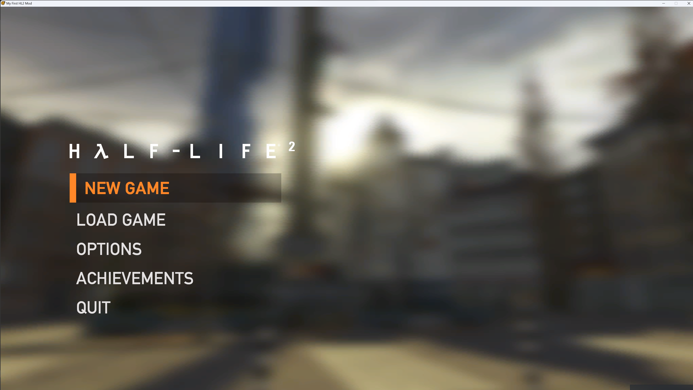

# Half-Life 2 GamepadUI

## What is it?

Source code for the Steam Deck GamepadUI I made used by Half-Life 2, Episode 1, Episode 2 and Portal 1.

It looks like this:

It's definitely not the cleanest thing in existence, especially as it was pretty rushed for the Steam Deck launch. However, you may be able to get some use out of it.

## What is here?

Provided is the full GamepadUI code, as well as the .vpc projects to build it. Pre-built binaries for stock Source SDK 2013 are included as well (Windows only right now). 

The UI can be enabled by adding `-gamepadui` to the startup parameters.

## Compiling

You will need to add gamepadui for each game to your projects.vgc and groups.vgc for the Visual Studio, etc projects to be generated.

Also provided is a modified cdll_client_int.cpp with the modifications needed for GamepadUI stuff to work. Check out the parts that reference GamepadUI and merge them into your codebase. You will also need to add a definition for GAMEPADUI somewhere in the preprocessor section of the client VPC script, to enable those edits. example: 

$PreprocessorDefinitions		"$BASE;GAMEPADUI"

Lastly, the function PostMessageToAllSiblingsOfType will need to be re-enabled in Panel.h, by removing its associated #if 0 / #endif. Despite the code comment declaring otherwise, this function is safe to compile, and is necessary for GamepadUI to compile.

## SDK 2013 Notes

SDK 2013 by default does not have the modifications to the regular GameUI that were made that do things such as hide the main menu logo, or have the new loading screens.  
Provided in `game/bin` is a copy of GameUI for SDK 2013 with the modifications you can use, unfortunately the code for this cannot be provided.

 `IsSteamDeck()` currently returns a check for -gamepadui on the startup parameters. This can be modified as needed.

## Credits

Special thanks to Madi for taking my code and making it compile against SDK 2013. 
Thanks to my friend Dan Smith for helping with getting some screenshots for the chapter art.
